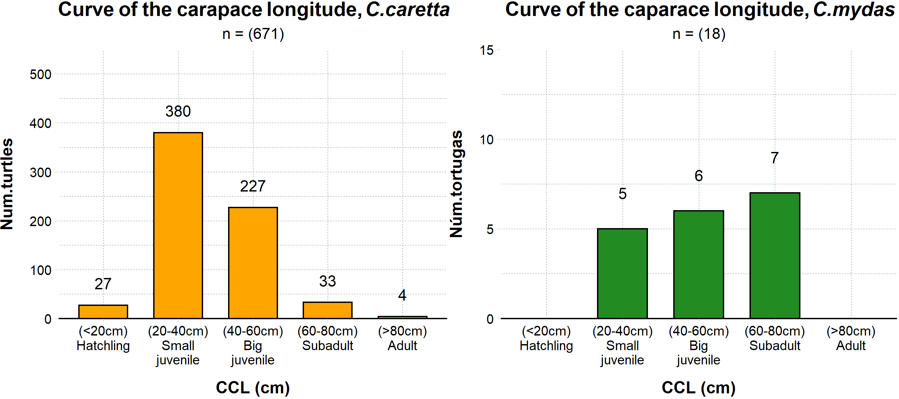
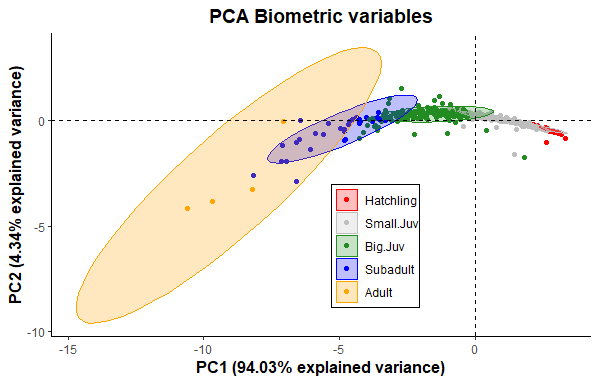
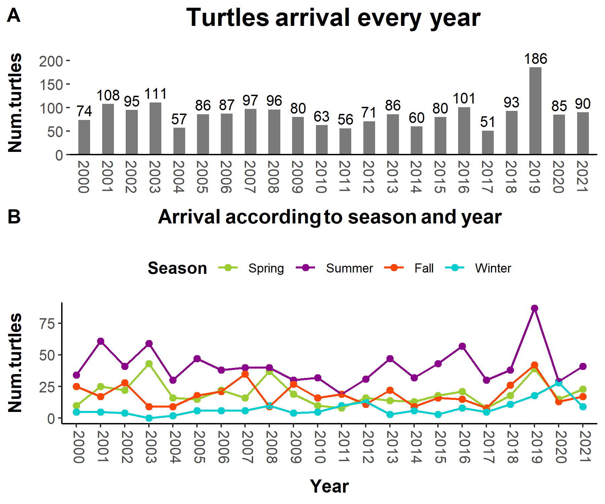
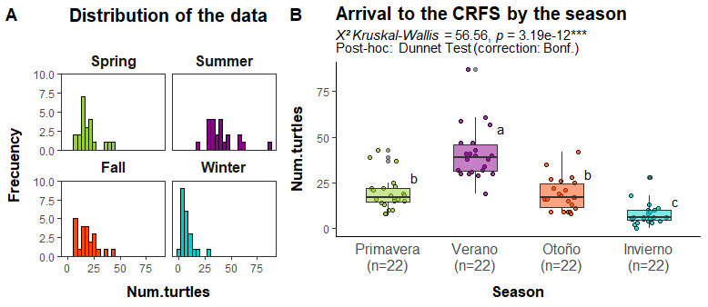
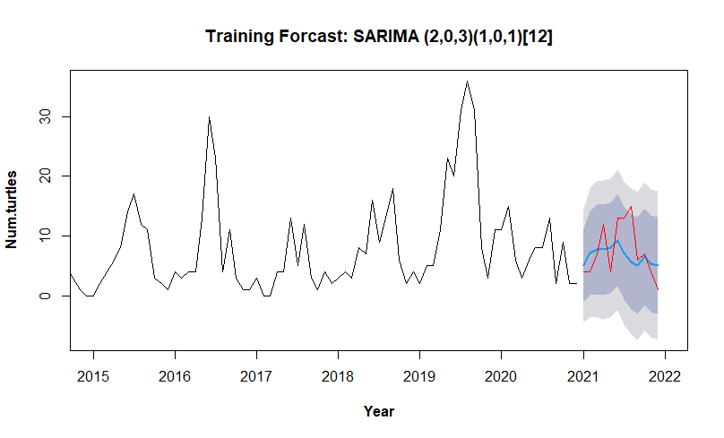
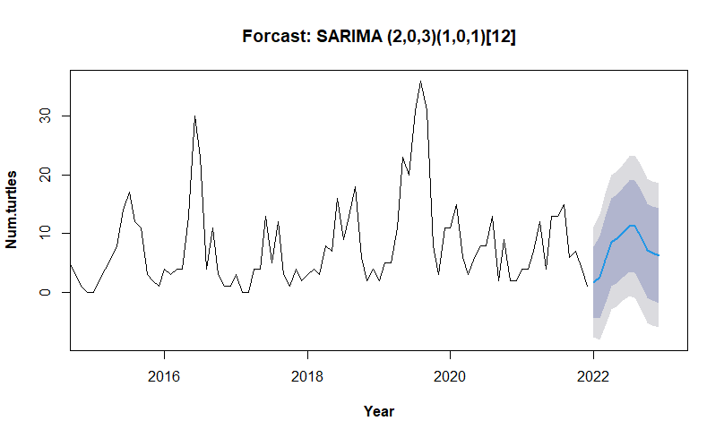
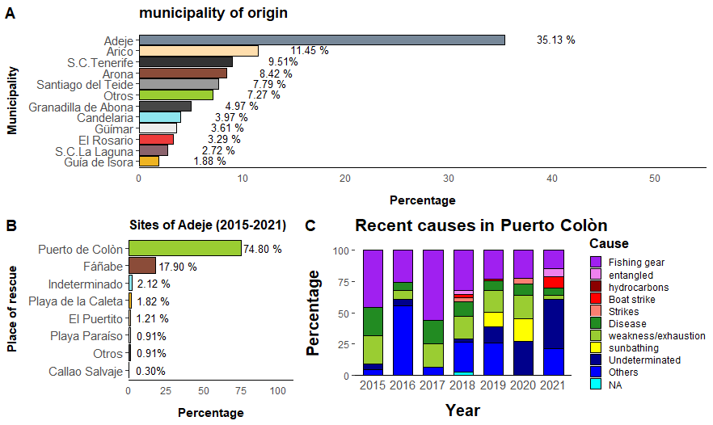
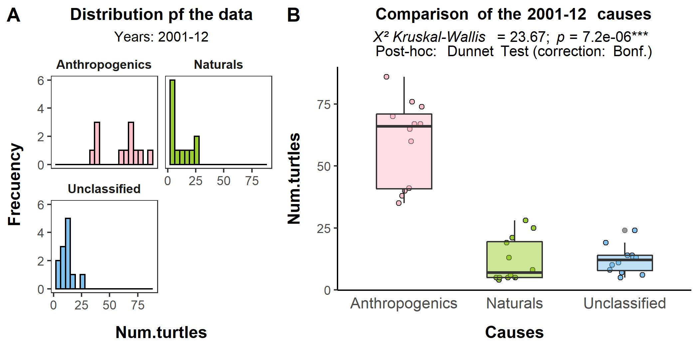
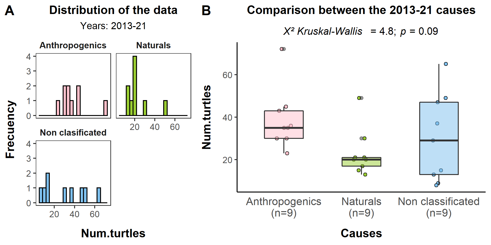
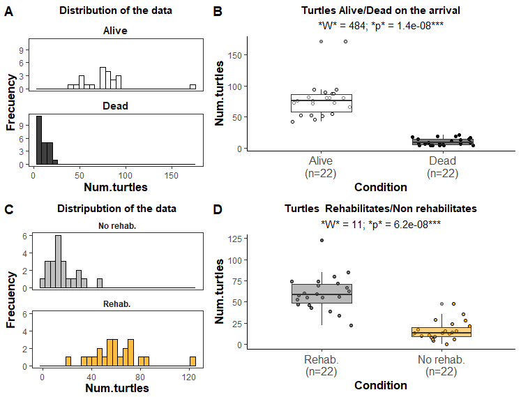

# <div style='text-align: justify'>Results of "Statistical analysis of sea turtles strandings in Tenerife, Canary Islands". (Hightlights)</d>

### <div style='text-align: justify'>Note: maybe it is not finished yet, do not judge me harshly please!!!</d> 

## Abstract:

<p align='justify'>The Chelonian order is formed by two families and seven species of sea turtles, all of which are on the IUCN Red List and Appendix I of CITES. Because of that, it is important to study their strandings in the Canary Islands. The most representative was *Caretta caretta*, arriving mainly juveniles, especially in summer, followed by fall and spring equally and winter where less. When a forecast was made for 2022, it was seen that this pattern could occur in a similar way. Adeje was the municipality with the highest number of turtles arriving, mostly from Puerto Colòn, a tourist area. In fact, the most common causes were of anthropogenic origin, especially those related to fishing gear, but have been decreasing until now, with a slight increase of the natural ones and a large one of the undetermined causes. Most of the turtles are alive when they have been rescued, being rehabilitated most of them, where the injuries on the fins are the main affection, suffering necrosis and amputations.</p>

<div style='text-align: justify'><strong>Keywords</strong>: loggerhead, <em>Caretta caretta</em>, Canary Islands, strandings, sea turtles.</d>

## **1) Species and biometric study of the turtles.**

### <div style='text-align: justify'>In terms of numbers, <em>Caretta caretta</em> was the most common out of all of the turtles, representing 96.92% of the individuals. In total, there was five species, and over all, 1913 turtles identified.</d>

* *Caretta caretta* (loggerhead turtle): 1854
* *Chelonya mydas* (green turtle) : 51
* *Dermochelys coriacea* (leatherback turtle): 6
* *Eretmochelys imbricata* (hawksbill turtle): 1
* *Lepidochelys olivacea* (Olive ridley turtle): 1

<div style='text-align: justify'>We did a biometric study of the turtles. First, We used the Curved of the caparace longitude (what is known by "CCL"). Some authors (<em>Liria-Lozoa et al., 2018</em>) have used this parameter to determined the state of their lifecycle (more likely for the loggerheads and green turtles).</d>

<div style='text-align: justify'>What we saw was that, approximatly 90% of the loggerhead turtles were juveniles. In case of the green turtle; the sample was too small in order to take some good conclusions.</d>

<div style='text-align: justify'>The results of the loggerhead has sense because the Canary Islands is a place for the juveniles to feed (Investigadores de la ULL colaboran con pescadores y cofradías para proteger a las tortugas boba y verde, 2022; Liria-Lozoa <em>et al.</em>, 2021; Mansfield & Putman, 2013), before they continue with migration patterns to reproduction routes (like Cabo Verde).</d>

---

<p align="center">
 
  

</p>

<div style='text-align: justify'><strong><em>Figure 3.</strong></em> <em>Estimation of the lifecycle using the CCL for the loggerhead and green turtle</em>.</d>

---

<div style='text-align: justify'>After that, we did a Principal Component Analisis (PCA), in order to try to extract the maximun information of all the biometric variables. We chose the first 2 components because, together with each other, they explained ~98% of the variance, where the PC1 explained ~94% and the PC2 ~4%.</d>

<div style='text-align: justify'>We used the Pearson Correlation Test, to compare the PC, with the biometrics variables. All of them  were highly correlated and negatively with the first component. Meanwhile, the second component, the only variable with a respectful (but not high at all) level of negative correlation, was the weight. The size of the carapace for the second on the other hand were poorly positive correlated.

<div style='text-align: justify'>This could mean that the PC1 would explain that the turtles that are growing in carapace size and also weight, are more in the left of the graph of the <strong>Figure 4</strong>. In this case when we put the results of the lifecycle, groups were formed and ordered coherently:

1. Hatchlings 
2. Juveniles (small and bigs) 
3. Subadults and 
4. Adults. 

<div style='text-align: justify'>The second component could mean that the ones in the positive frame of the PC2 axis, the juveniles turtles (small and big sizes), are growing in terms of carapace size. On the other hand, the ones in the negative, the hatchlings, subadults and adults seems to being growing in weight in this state.

---

<p align="center">
 
  

</p>

***Figure 4.*** *PCA of the biometric variables (loggerhead turtle). Different groups depending on the living cycle were formed*

---

## **2) Temporal Study and forecast for 2022.**

The results showed tha there wasn't a clear pattern in terms of the year of arrival. That wasn't the case for the season. In this case, the majority of the turtles come in summer, it woudl seems that in the spring and fall season, come equally, and in winter it would be when less of them arrive.

---

<p align="center">
 
  

</p>

<div style='text-align: justify'><strong><em>Figure 5.</strong></em> <em>Temporal evolution of the turtles arrivals</em>

---

<div style='text-align: justify'>So, to see if this differences were significants, we did a test of Kruskal-Wallis, the data distribution wasn't normal, as with the rest of the studies. and because <em>p</em> < 0.05, we did the Dunnet Test as a Post-Hoc (with the Bonferroni correction). 

* The summer season was *p* < 0.05 with the rest.
* In case of Spring and fall *p* > 0.05. 
* Winter was *p* < 0.05 with the rest.

---

<p align="center">
 
  

</p>

<div style='text-align: justify'><strong><em>Figure 6.</strong> <strong>A</strong> Histograms that shows the data distribution, <strong>B</strong> Boxplot for comparing the seasons</em>

---

<div style='text-align: justify'>We did a time series analysis. We got a SARIMA model and the components of the model were:

( p, d, q ) x ( P, D, Q )<sub>S</sub>

* No seasonal components: (p = 2, d = 0, q = 3 )
* Seasonal components: ( P = 1, D = 0, Q = 1 )
* seasonal period: S = 12
 
 <div style='text-align: justify'>In order to guarantee that the model was optimal. We first made sure that the data was stational by the Dickey-Fuller test (<em>p</em> < 0.05), we also did a Ljung-Box test, to corroborate the existence of white noise (<em>p</em> > 0.05). And finally before the forecast for 2022, we did a training model one for 2021, to make sure that it didn't fail on the reality and had good results.

 <div style='text-align: justify'>In the end, it would appear that for the 2022 year the pattern would seem similar to the annual pattern. There is going to be a increase number of turtles since beginning of the year, until a possible peak in Summer. After that there is going to be a negative tendency since fall start to the last month of the study (December).

 ---
 
 <p align="center">
  
  

</p>
 
<div style='text-align: justify'><strong><em>Figure 8.</strong> Training Model to see how it adjusted to the data in 2021 in red, in blue other whise, is the forecast for this year and the coluds are the confidence intervals of the model.</em>
 
<p align="center">
 
  

</p>
 
<div style='text-align: justify'><strong><em>Figura 9.</strong> Forecast for the year 2022.</em> 
 
 ---

 ## **<div style='text-align: justify'>3) Municipality and places of rescue.**

<div style='text-align: justify'>The municipality where a significant percentage of turtles arrive is Adeje, and the place in specific inside here is Puerto Colòn, a place with port and recreational sea attractions as aquatic bikes.

<div style='text-align: justify'>Even though, a study of the actual causes, showed that the boat strikes or strikes in general where scarce. The fishing gear causes were the main one. It is true, that in some of the years (specially in the last ones), there are a lot of non unclassified, wich could be masking the real results.

---

<p align="center">
 
  

</p>

<div style='text-align: justify'><strong><em>Figure 10 and 11</strong> A Municipalities percentages of sea turtles stranding B Places of the strandings inside Puerto Colòn, the municipality with the greatest numbers. C Bar char of the recent causes in this place.</em> 

---

## <div style='text-align: justify'>5) General causes of the strandings

<div style='text-align: justify'>We divided the causes in three groups:

* Anthropogenic causes.
* Natural causes.
* Unclassified.

<div style='text-align: justify'>The years from 2001 to 2012 (2000 was excluded because more than 80% of the causes were unclassified), the causes were significant with each other <em>p</em> < 0.05, being the significance between the causes made by humans and the other two (between the naturals and unclassified, <em>p</em> > 0.05). 

But, for the years 2013 to 2021, the causes were *p* > 0.05 for all the groups. 

---

<p align="center">
 
  

</p>

<div style='text-align: justify'><strong><em>Figure 12.</strong> Evolution of the causes 2001-2021.</em>

<p align="center">
 
  

</p>

<div style='text-align: justify'><strong><em>Figure 13 A</strong>  Distribution of the data and <strong>B</strong>  boxplot for comparing the causes for the years 2001-12</em>


<p align="center">
 
  

</p>

<div style='text-align: justify'><strong><em>Figure 14. A</strong> Distribution of the data and <strong>B</strong> boxplot for comparing the causes for the years 2013-21</em>

---

<div style='text-align: justify'>Then, because of these results, we did a table, which showed a possible explaination. It seems that is because the decrease of the anthropogeneic causes, in specific, a reduction of fishing gear (the principle cause of stranding). Also, the unclassified causes have been increasing, specially this last years, which could be affecting this study. In other words, we probably are not able to see the reality of the situation because the number of this last causes are so high.

<p align="center">
 
  

</p>

## <div style='text-align: justify'>6) Turtles that arrive alive, dead and can be rehabilitated or not.

<div style='text-align: justify'>In these terms, our results showed that the majority of the turtles arrive alive to La Tahonilla. Also, their prognostic is really favorable, being most of them rehabilitated.

<div style='text-align: justify'>We tested these differences using Wilocxon, seeing that between the first comparison <em>p</em> < 0.05. On the other hand, in case of the rehabilitated, the differences were <em>p</em> < 0.05 as well.

---

<p align="center">
 
  

</p>

<div style='text-align: justify'><strong><em>Figure 15. A, C</strong> Distribution of the data and <strong>B, D</strong> boxplot for comparing the groups.</em>

---

## <div style='text-align: justify'>7) Observation that the La Tahonilla workers made to the turtles when they arrive to the center.

Finally, we will talk about the observations that the workers annotated when the turtles arrive to the center. To do that, we used this algorithm to extract the information in the datasets (credit to Carlos).

```

selec <-function(ord,lista_tokens,var) {
  paste(lista_tokens[-ord],collapse="|")
  if(!is.na(ord)) return(grepl(lista_tokens[ord],tolower(var)) & !grepl(paste(lista_tokens[-ord],collapse="|"),tolower(var)))
  else return(grepl(paste(lista_tokens,collapse="|"),tolower(var)))
}

```

Using this code we filtered the values of interest, being able to classified some of the turles for three sepcific variables (even though, a lot of them weren't able to clasiffy with this method):

* Injuries.
* Affections.
* Parts of the body affected.

The most common value of all, including all three variables, were the fins. Also, we create heatmaps to compare the variables. What we saw was that there was a **triple coincidence**: The fins were correlated with the affection of necrosis, as well with the injury of amputations (logically). But also, what was really interesting, it was that the necrosis were also correlated with the amputations.

---

<p align="center">
 
  

</p>

***Figure 16.*** *List of the values of "Observations": **A** part of the body, **B** the state pf the turtles, **C** injuries.*

<p align="center">
 
  

</p>

***Figure 17.*** *Heatmaps: **A** relation between the state and the part of the body affected, **B** between the injuries and the part of the body, **C** the injuries and the state.*

---


## <div style='text-align: justify'>REFERENCES (exclusively, the one needed for this highlights)

[1] Investigadores de la ULL colaboran con pescadores y cofradías para proteger a las tortugas boba y verde. (16 de febrero 2022). ULL Noticias. (https://www.ull.es/portal/noticias/2022/investigadores-de-la-ull-ensenan-a-pescadores-y-cofradias-como-proteger-a-las-tortugas-boba-y-verde/)

[2] Liria-Loza A., Fariñas-Bermejo A., Ostiategui-Francia P., Usategui-Martín A. (2021). Protocolo de actuación frente a varamientos de tortugas marinas en Canarias. Gobierno de Canarias (Fondos FEDER. ISBN: 978-84-09-32808-6).

[3] Mansfield. K.L. & Putman, N. (2013). “Oceanic habits and habitats Caretta Caretta.” En The Biology of Sea Turtles, Volume III, edited by Jeanette Wyneken Kenneth J. Lohmann John A Musick, 189–211. CRC Marine Science

### My TFG: García-Estupiñán, J.C. (2022). Análisis estadístico de Tortugas marinas varadas en Tenerife, Islas Canarias. University of La Laguna.

